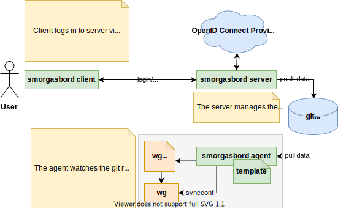

# Smorgasbord

> a range of open sandwiches and delicacies served as hors d'oeuvres or a buffet

Smorgasbord purpose is to ease up the administration of a wireguard-based VPN.  
It creates, stores and distributes client configurations for its users and can
derive server configuration using the provided agent.
Users can self-service their public keys after authenticating via OpenID Connect.
Rather than using a database the public keys and metadata are commited to a
git repository, which is used as storage endpoint.

Smorgasbord primary goal is to provide a minimalistic environment to manage
users across multiple wireguard servers applicable to embedded systems as well
as more complex installments.

## About the name

This project started a late night project and the name was essentially what
came up first after googling "synonym self-service".
It might therefore be subject to change.

